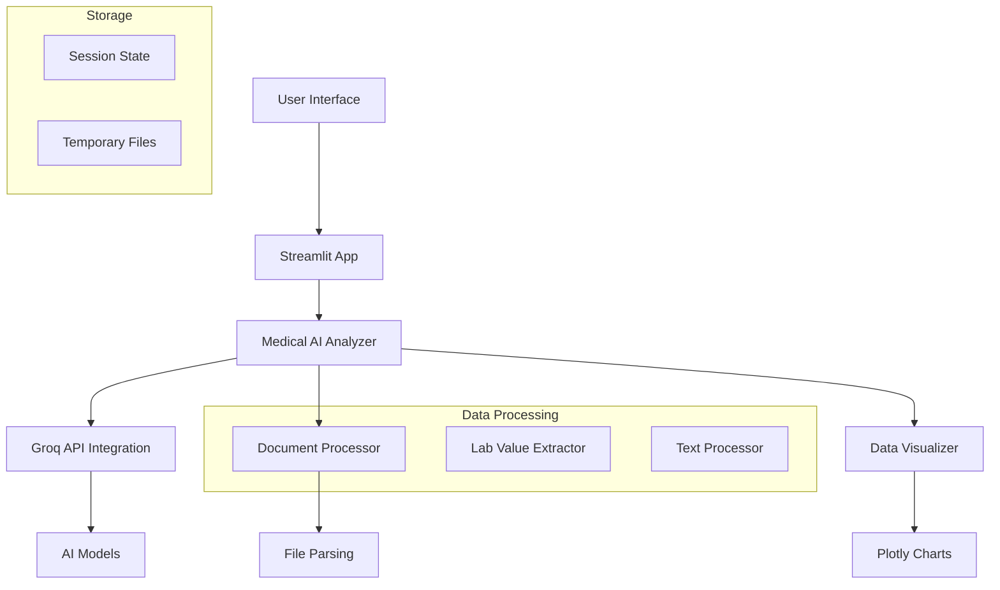

```markdown
<div align="center">

# MediAI Pro 🤖


**AI-Powered Medical Analysis Platform | Real-time Health Insights | Clinical Decision Support**

[](https://demo.example.com)
[](https://github.com/yourusername/mediai-pro/issues)
[](https://github.com/yourusername/mediai-pro/issues)

</div>

## 📋 Table of Contents
- [✨ Features](#-features)
- [🚀 Quick Start](#-quick-start)
- [🛠️ Installation](#️-installation)
- [🔧 Configuration](#-configuration)
- [📖 Usage Guide](#-usage-guide)
- [🏗️ Architecture](#️-architecture)
- [📁 Project Structure](#-project-structure)
- [🤖 AI Capabilities](#-ai-capabilities)
- [📊 Data Visualization](#-data-visualization)
- [🔒 Security & Privacy](#-security--privacy)
- [🤝 Contributing](#-contributing)
- [📄 License](#-license)
- [📞 Contact](#-contact)

## ✨ Features

### 🎯 Core Features
- **🤖 AI-Powered Medical Analysis** - Advanced LLM integration for intelligent health insights
- **📄 Multi-Format Document Processing** - PDF, DOCX, TXT medical report parsing
- **💬 Interactive Medical Chat** - Real-time Q&A with medical AI assistant
- **📊 Advanced Health Analytics** - Interactive data visualizations and trend analysis
- **🔬 Lab Result Interpretation** - Automated analysis of blood tests and medical reports

### 🛡️ Professional Features
- **⚡ Real-time API Integration** - Groq AI with multiple model support
- **🎨 Professional UI/UX** - Streamlit-based modern medical dashboard
- **🔐 Secure Data Handling** - Local processing with optional cloud integration
- **📱 Responsive Design** - Works on desktop, tablet, and mobile devices

### 🚀 Technical Highlights
- Multi-Model AI Support (Llama 3.1, Mixtral, Gemma2)
- Rate Limiting & Error Handling
- Session State Management
- File Validation & Processing
- Real-time Data Visualization

## 🚀 Quick Start

### Prerequisites
- Python 3.9+
- pip 20.0+
- Groq API Key (optional for enhanced features)

### One-Line Installation
```bash
pip install -r requirements.txt && streamlit run app.py
```

## 🛠️ Installation

### Method 1: Standard Installation
```bash
# Clone the repository
git clone https://github.com/yourusername/mediai-pro.git
cd mediai-pro

# Create virtual environment
python -m venv venv

# Activate virtual environment
# On Windows:
venv\Scripts\activate
# On Mac/Linux:
source venv/bin/activate

# Install dependencies
pip install -r requirements.txt

# Run the application
streamlit run app.py
```

### Method 2: Docker Installation
```dockerfile
# Build Docker image
docker build -t mediai-pro .

# Run container
docker run -p 8501:8501 mediai-pro
```

## 🔧 Configuration

### Environment Setup
Create `.env` file:
```env
GROQ_API_KEY=your_groq_api_key_here
SECRET_KEY=your_secret_key
ENVIRONMENT=development
```

Streamlit Secrets (for cloud deployment):
```toml
# .streamlit/secrets.toml
GROQ_API_KEY = "your_groq_api_key_here"
```

### API Configuration
```python
# Supported AI Models
MODELS = [
    "llama-3.1-8b-instant",
    "mixtral-8x7b-32768", 
    "gemma2-9b-it"
]

# Rate Limiting
RATE_LIMIT_DELAY = 2  # seconds between API calls
MAX_TOKENS = 800
TEMPERATURE = 0.7
```

## 📖 Usage Guide

### 1. Patient Data Entry
- Enter patient demographics (name, age, gender)
- Input medical history and symptoms
- Upload medical reports (PDF/DOCX/TXT)
- Paste lab results manually

### 2. AI Analysis
- Click "🚀 Analyze Data" for comprehensive analysis
- View AI-generated insights and recommendations
- Explore interactive visualizations

### 3. Medical Chat
- Ask specific medical questions
- Get instant AI responses
- Discuss lab results and symptoms

### 4. Report Generation
- Export analysis results
- Generate PDF summaries
- Share insights with healthcare providers

## 🏗️ Architecture



## 📁 Project Structure
```
mediai-pro/
│
├── app.py                          # Main application file
├── requirements.txt               # Dependencies
├── README.md                      # Project documentation
│
├── .streamlit/
│   ├── config.toml               # Streamlit configuration
│   └── secrets.toml              # API keys (gitignored)
│
├── assets/
│   ├── images/                   # Static images
│   └── styles/                   # Custom CSS
│
├── utils/
│   ├── document_processor.py     # File parsing utilities
│   ├── ai_integration.py        # API communication
│   ├── data_visualizer.py       # Chart generation
│   └── security.py              # Security utilities
│
├── tests/
│   ├── test_document_processing.py
│   ├── test_ai_integration.py
│   └── test_ui_components.py
│
└── docs/
    ├── api_reference.md          # API documentation
    ├── user_guide.md            # User manual
    └── deployment_guide.md      # Deployment instructions
```

## 🤖 AI Capabilities

### Medical Analysis Features
- **Lab Result Interpretation** - Automatic detection of abnormal values
- **Symptom Analysis** - AI-powered symptom checking
- **Treatment Recommendations** - Evidence-based suggestions
- **Risk Assessment** - Health risk evaluation

### Supported Medical Tests
```python
LAB_RANGES = {
    'WBC': {'low': 4.0, 'high': 11.0, 'unit': '10^3/μL'},
    'RBC': {'low': 4.2, 'high': 5.8, 'unit': '10^6/μL'},
    'Hemoglobin': {'low': 12.0, 'high': 16.0, 'unit': 'g/dL'},
    'Hematocrit': {'low': 36, 'high': 48, 'unit': '%'},
    # ... 20+ additional tests
}
```

### Fallback System
- **Local Knowledge Base** - Functions without API
- **Pattern Recognition** - Extracts lab values from text
- **Pre-defined Responses** - Medical guidance templates

## 📊 Data Visualization

### Interactive Charts
- **Bar Charts** - Lab value comparisons
- **Trend Lines** - Historical data tracking
- **Health Metrics** - Visual status indicators
- **Custom Dashboards** - Patient-specific views

### Example Visualization
```python
fig = px.bar(df, x='Test', y='Value', color='Status', 
             title='Lab Results Overview')
fig.update_layout(template='plotly_white')
```

## 🔒 Security & Privacy

### Data Protection
- **Local Processing** - Data stays on user's machine
- **No PII Storage** - Personal information not persisted
- **Secure API Calls** - Encrypted communications
- **Session Isolation** - Separate data per session

### Compliance Features
- **HIPAA-Aware Design** - Medical data considerations
- **GDPR Compliant** - Data privacy by design
- **Audit Logging** - Activity tracking
- **Data Encryption** - Secure storage

## 🚀 Deployment

### Cloud Deployment Options

#### Streamlit Cloud
```bash
# Push to GitHub
git push origin main

# Deploy via Streamlit Cloud Dashboard
# Connect GitHub repository
# Set environment variables
```

#### Docker Deployment
```dockerfile
FROM python:3.9-slim
WORKDIR /app
COPY requirements.txt .
RUN pip install --no-cache-dir -r requirements.txt
COPY . .
EXPOSE 8501
CMD ["streamlit", "run", "app.py", "--server.port=8501"]
```

#### Traditional Hosting
```bash
# Install system dependencies
sudo apt-get update
sudo apt-get install python3-pip nginx

# Setup systemd service
sudo systemctl enable mediai-pro
sudo systemctl start mediai-pro
```

## 🤝 Contributing

We welcome contributions! Please see our contributing guidelines:

### Development Setup
```bash
# Fork the repository
git clone https://github.com/yourusername/mediai-pro.git
cd mediai-pro

# Create feature branch
git checkout -b feature/amazing-feature

# Make changes and commit
git commit -m 'Add amazing feature'

# Push to branch
git push origin feature/amazing-feature

# Create Pull Request
```

### Contribution Areas
- 🐛 Bug fixes
- ✨ New features
- 📚 Documentation improvements
- 🎨 UI/UX enhancements
- 🔧 Performance optimizations

## 📄 License

This project is licensed under the MIT License - see the LICENSE file for details.

```text
MIT License

Copyright (c) 2024 MediAI Pro

Permission is hereby granted, free of charge, to any person obtaining a copy
of this software and associated documentation files (the "Software"), to deal
in the Software without restriction, including without limitation the rights
to use, copy, modify, merge, publish, distribute, sublicense, and/or sell
copies of the Software, and to permit persons to whom the Software is
furnished to do so, subject to the following conditions:

The above copyright notice and this permission notice shall be included in all
copies or substantial portions of the Software.

THE SOFTWARE IS PROVIDED "AS IS", WITHOUT WARRANTY OF ANY KIND, EXPRESS OR
IMPLIED, INCLUDING BUT NOT LIMITED TO THE WARRANTIES OF MERCHANTABILITY,
FITNESS FOR A PARTICULAR PURPOSE AND NONINFRINGEMENT. IN NO EVENT SHALL THE
AUTHORS OR COPYRIGHT HOLDERS BE LIABLE FOR ANY CLAIM, DAMAGES OR OTHER
LIABILITY, WHETHER IN AN ACTION OF CONTRACT, TORT OR OTHERWISE, ARISING FROM,
OUT OF OR IN CONNECTION WITH THE SOFTWARE OR THE USE OR OTHER DEALINGS IN THE
SOFTWARE.
```

## 📞 Contact

### Project Maintainer
**Muhammad Awais**
- GitHub: [@muhammadawaislaal](https://github.com/muhammadawaislaal)
- Email: your.email@example.com
- LinkedIn: [Your Profile](https://linkedin.com/in/yourprofile)

### Support Channels
- 📖 Documentation
- 🐛 [Issue Tracker](https://github.com/yourusername/mediai-pro/issues)
- 💬 Discussions
- 📧 Email Support

<div align="center">

## ⭐ Star the Repository

If you find this project useful, please give it a star on GitHub!


**Made with ❤️ for the Medical Community**

---

**Disclaimer:** This tool provides AI-generated insights and should not replace professional medical advice. Always consult with qualified healthcare providers for medical decisions.

</div>
```
